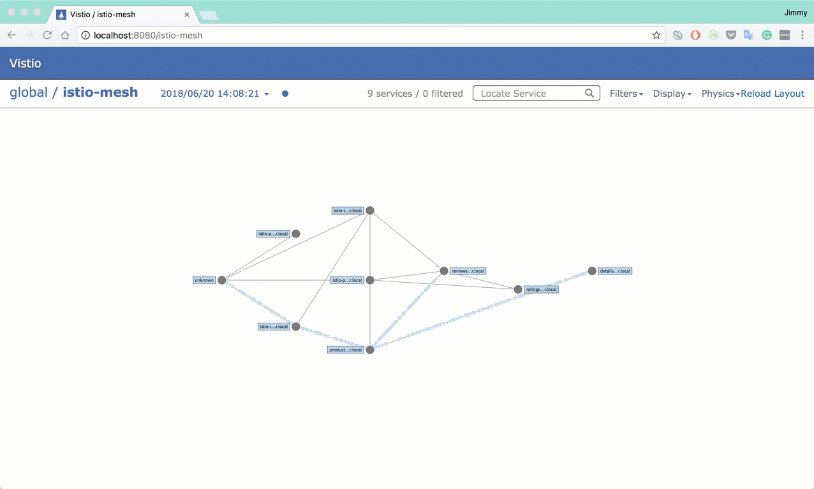

# Setting up a distributed Kubernetes cluster along with Istio service mesh locally with Vagrant and VirtualBox

[使用Vagrant和VirtualBox在本地搭建分布式Kubernetes集群和Istio Service Mesh - 中文](README-cn.md)

Setting up a Kubernetes cluster and istio service mesh with `vagrantfile` which consists of 1 master(also as node) and 3 nodes. You don't have to create complicated CA files or configuration.

### Why not use kubeadm?

Because I want to setup the etcd, apiserver, controller and scheduler without docker container.

### Architecture

We will create a Kubernetes 1.11.0 cluster with 3 nodes which contains the components below:

| IP           | Hostname | Componets                                |
| ------------ | -------- | ---------------------------------------- |
| 172.17.8.101 | node1    | kube-apiserver, kube-controller-manager, kube-scheduler, etcd, kubelet, docker, flannel, dashboard |
| 172.17.8.102 | node2    | kubelet, docker, flannel、traefik         |
| 172.17.8.103 | node3    | kubelet, docker, flannel                 |

The default setting will create the private network from 172.17.8.101 to 172.17.8.103 for nodes, and it will use the host's DHCP for the public IP.

The kubernetes service's VIP range is `10.254.0.0/16`.

The container network range is `170.33.0.0/16` owned by flanneld with `host-gw` backend.

`kube-proxy` will run as `ipvs` mode.

## Usage

### Prerequisite

* Host server with 8G+ mem(More is better), 60G disk, 8 core cpu at lease
* Vagrant 2.0+
* VirtualBox 5.0+
* Kubernetes 1.9+ (support the latest version 1.11.0)
* Across GFW to download the kubernetes files (For China users only)
* MacOS/Linux (**Windows is not supported completely**)

### Support Add-ons

**Required**

- CoreDNS
- Dashboard
- Traefik

**Optional**

- Heapster + InfluxDB + Grafana
- ElasticSearch + Fluentd + Kibana
- Istio service mesh
- Helm
- Vistio
- Kiali

#### Setup

Clone this repo into your local machine and download kubernetes binary release first and move them into  the root directory of this repo.

```bash
git clone https://github.com/rootsongjc/kubernetes-vagrant-centos-cluster.git
cd kubernetes-vagrant-centos-cluster
wget https://storage.googleapis.com/kubernetes-release/release/v1.11.0/kubernetes-server-linux-amd64.tar.gz
```

Note: you can find download address of the Kubernetes releases [here](https://kubernetes.io/docs/imported/release/notes/).

Set up Kubernetes cluster with vagrant.

```bash
vagrant up
```

Wait about 10 minutes the kubernetes cluster will be setup automatically.

**Note**

If you have difficult to vagrant up the cluster because of have no way to downlaod the `centos/7` box, you can download the box and add it first.

**Add centos/7 box manually**

```bash
wget -c http://cloud.centos.org/centos/7/vagrant/x86_64/images/CentOS-7-x86_64-Vagrant-1801_02.VirtualBox.box
vagrant box add CentOS-7-x86_64-Vagrant-1801_02.VirtualBox.box --name centos/7
```

The next time you run `vagrant up`, vagrant will import the local box automatically.

**For Windows**

While running `vagrant up` in Windows, you will see the following output:

```bash
G:\code\kubernetes-vagrant-centos-cluster>vagrant up
Bringing machine 'node1' up with 'virtualbox' provider...
Bringing machine 'node2' up with 'virtualbox' provider...
Bringing machine 'node3' up with 'virtualbox' provider...
==> node1: Importing base box 'centos/7'...
==> node1: Matching MAC address for NAT networking...
==> node1: Setting the name of the VM: node1
==> node1: Clearing any previously set network interfaces...
==> node1: Specific bridge 'en0: Wi-Fi (AirPort)' not found. You may be asked to specify
==> node1: which network to bridge to.
==> node1: Available bridged network interfaces:
1) Realtek PCIe GBE Family Controller
2) TAP-Windows Adapter V9
==> node1: When choosing an interface, it is usually the one that is
==> node1: being used to connect to the internet.
    node1: Which interface should the network bridge to?
    node1: Which interface should the network bridge to?
```

Press `1` to continue. (Choose the corresponding network interface for node2 and node3)

You will see these output while node3 is going to be complete:

```bash
node3: Created symlink from /etc/systemd/system/multi-user.target.wants/kubelet.service to /usr/lib/systemd/system/kubelet.service.
    node3: Created symlink from /etc/systemd/system/multi-user.target.wants/kube-proxy.service to /usr/lib/systemd/system/kube-proxy.service.
    node3: deploy coredns
    node3: /tmp/vagrant-shell: ./dns-deploy.sh: /bin/bash^M: bad interpreter: No such file or directory
    node3: error: no objects passed to apply
    node3: /home/vagrant
```

Solution:

```bash
vagrant ssh node3
sudo -i
cd /vagrant/addon/dns
yum -y install dos2unix
dos2unix dns-deploy.sh
./dns-deploy.sh -r 10.254.0.0/16 -i 10.254.0.2 |kubectl apply -f -
```

#### Connect to kubernetes cluster

There are 3 ways to access the kubernetes cluster.

- on local
- login to VM
- Kubernetes dashboard

**local**

In order to manage the cluster on local you should Install `kubectl` command line tool first.

Go to [Kubernetes release notes](https://kubernetes.io/docs/imported/release/notes/), download the client binaries, unzip it and then move `kubectl`  to your `$PATH` folder, for MacOS:

```bash
wget https://storage.googleapis.com/kubernetes-release/release/v1.11.0/kubernetes-client-darwin-amd64.tar.gz
tar xvf kubernetes-client-darwin-amd64.tar.gz && cp kubernetes/client/bin/kubectl /usr/local/bin
```

Copy `conf/admin.kubeconfig` to `~/.kube/config`, using `kubectl` CLI to access the cluster.

```bash
mkdir -p ~/.kube
cp conf/admin.kubeconfig ~/.kube/config
```

We recommend you fellow this way.

**VM**

Login to the virtual machine for dubuging. In most situations, you have no need to login the VMs.

```bash
vagrant ssh node1
sudo -i
kubectl get nodes
```

**Kubernetes dashboard**

Kubernetes dashboard URL: <https://172.17.8.101:8443>

Get the admin token:

```bash
kubectl -n kube-system describe secret `kubectl -n kube-system get secret|grep admin-token|cut -d " " -f1`|grep "token:"|tr -s " "|cut -d " " -f2
```

**Note**: You can see the token message on console when  `vagrant up` done.


Only if you install the heapter addon bellow that you can see the metrics.

**Visit from Chrome/Firefox on Windows**

If you see the hint `NET::ERR_CERT_INVALID`, follow these steps:

```bash
vagrant ssh node1
sudo -i
cd /vagrant/addon/dashboard/
mkdir certs
openssl req -nodes -newkey rsa:2048 -keyout certs/dashboard.key -out certs/dashboard.csr -subj "/C=/ST=/L=/O=/OU=/CN=kubernetes-dashboard"
openssl x509 -req -sha256 -days 365 -in certs/dashboard.csr -signkey certs/dashboard.key -out certs/dashboard.crt
kubectl delete secret kubernetes-dashboard-certs -n kube-system
kubectl create secret generic kubernetes-dashboard-certs --from-file=certs -n kube-system
kubectl delete pods $(kubectl get pods -n kube-system|grep kubernetes-dashboard|awk '{print $1}') -n kube-system #re-install dashboard
```

Refresh the browser and click `Advance`, skip it. You will see the dashboard page there.

## Components

**Heapster monitoring**

Run this command on your local machine.

```bash
kubectl apply -f addon/heapster/
```

Append the following item to your local `/etc/hosts` file.

```ini
172.17.8.102 grafana.jimmysong.io
```

Open the URL in browser: <http://grafana.jimmysong.io>


**Traefik**

Run this command on your local machine.

```bash
kubectl apply -f addon/traefik-ingress
```

Append the following item to your  local file  `/etc/hosts`.

```ini
172.17.8.102 traefik.jimmysong.io
```

Traefik UI URL: <http://traefik.jimmysong.io>


**EFK**

Run this command on your local machine.

```bash
kubectl apply -f addon/efk/
```

**Note**: Powerful CPU and memory allocation required. At least 4G per virtual machine.

**Helm**

Run this command on your local machine.

```bash
hack/deploy-helm.sh
```

### Service Mesh

We use [istio](https://istio.io) as the default service mesh.

**Installation**

Go to [Istio release](https://github.com/istio/istio/releases) to download the binary package, install istio command line tool on local and move `istioctl` to your `$PATH` folder, for Mac:

```bash
wget https://github.com/istio/istio/releases/download/1.0.0/istio-1.0.0-osx.tar.gz
tar xvf istio-1.0.0-osx.tar.gz
mv bin/istioctl /usr/local/bin/
```

Deploy istio into Kubernetes:

```bash
kubectl apply -f addon/istio/istio-demo.yaml
kubectl apply -f addon/istio/istio-ingress.yaml
```

**Run sample**

We will let the sidecars be auto injected.

```bash
kubectl label namespace default istio-injection=enabled
kubectl apply -n default -f yaml/istio-bookinfo/bookinfo.yaml
kubectl apply -n default -f yaml/istio-bookinfo/bookinfo-gateway.yaml
```

Add the following items into the file  `/etc/hosts` of your local machine.

```
172.17.8.102 grafana.istio.jimmysong.io
172.17.8.102 prometheus.istio.jimmysong.io
172.17.8.102 servicegraph.istio.jimmysong.io
```

We can see the services from the following URLs.

| Service      | URL                                                          |
| ------------ | ------------------------------------------------------------ |
| grafana      | http://grafana.istio.jimmysong.io                            |
| servicegraph | <http://servicegraph.istio.jimmysong.io/dotviz>, <http://servicegraph.istio.jimmysong.io/graph>,<http://servicegraph.istio.jimmysong.io/force/forcegraph.html> |
| tracing      | http://172.17.8.101:31888                                    |
| productpage  | http://172.17.8.101:31380/productpage                        |

More detail see https://istio.io/docs/guides/bookinfo.html


### Vistio

[Vizceral](https://github.com/Netflix/vizceral) is an open source project released by Netflix to monitor network traffic between applications and clusters in near real time. Vistio is an adaptation of Vizceral for Istio and mesh monitoring. It utilizes metrics generated by Istio Mixer which are then fed into Prometheus. Vistio queries Prometheus and stores that data locally to allow for the replaying of traffic.

Run the following commands in your local machine.

```bash
# Deploy vistio via kubectl
kubectl -n default apply -f addon/vistio/

# Expose vistio-api
kubectl -n default port-forward $(kubectl -n default get pod -l app=vistio-api -o jsonpath='{.items[0].metadata.name}') 9091:9091 &

# Expose vistio in another terminal window
kubectl -n default port-forward $(kubectl -n default get pod -l app=vistio-web -o jsonpath='{.items[0].metadata.name}') 8080:8080 &
```

If everything up until now is working you should be able to load the Vistio UI  in your browser http://localhost:8080



More details see [Vistio — Visualize your Istio Mesh Using Netflix’s Vizceral](https://itnext.io/vistio-visualize-your-istio-mesh-using-netflixs-vizceral-b075c402e18e).

### Kiali

Kiali is a project to help observability for the Istio service mesh, see [https://kiali.io](https://kiali.io/).

Run the following commands in your local machine.

```bash
kubectl apply -n istio-system -f addon/kiali
```

Kiali web: http://172.17.8.101:32439

User/password: admin/admin


**Note**: Kiali use jaeger for tracing. Do not block the pop-up windows for kiali.

### Weave scope

[Weave scope](https://github.com/weaveworks/scope) is a project for monitoring, visualisation & management for Docker & Kubernetes, see <https://www.weave.works/oss/scope/> 

Run the following commands in your local machine.

```bash
kubectl apply -f addon/weave-scope
```

Add a record on your local  `/etc/hosts`.

```
172.17.8.102 scope.weave.jimmysong.io
```

Now open your browser on http://scope.weave.jimmysong.io/


## Operation

Except for special claim, execute the following commands under the current git repo's root directory.

### Suspend

Suspend the current state of VMs.

```bash
vagrant suspend
```

### Resume

Resume the last state of VMs.

```bash
vagrant resume
```

Note: every time you resume the VMs you will find that the machine time is still at you last time you suspended it. So consider to halt the VMs and restart them.

### Restart

Halt the VMs and up them again.

```bash
vagrant halt
vagrant up
# login to node1
vagrant ssh node1
# run the prosivision scripts
/vagrant/hack/k8s-init.sh
exit
# login to node2
vagrant ssh node2
# run the prosivision scripts
/vagrant/hack/k8s-init.sh
exit
# login to node3
vagrant ssh node3
# run the prosivision scripts
/vagrant/hack/k8s-init.sh
sudo -i
cd /vagrant/hack
./deploy-base-services.sh
exit
```

Now you have provisioned the base kubernetes environments and you can login to kubernetes dashboard, run the following command at the root of this repo to get the admin token.

```bash
hack/get-dashboard-token.sh
```

Following the hint to login.

### Clean

Clean up the VMs.

```bash
vagrant destroy
rm -rf .vagrant
```

### Note

Only use for development and test, don't use it in production environment.

## Reference

* [Kubernetes Handbook - jimmysong.io](https://jimmysong.io/kubernetes-handbook/)
* [duffqiu/centos-vagrant](https://github.com/duffqiu/centos-vagrant)
* [coredns/deployment](https://github.com/coredns/deployment)
* [kubernetes ipvs](https://github.com/kubernetes/kubernetes/tree/master/pkg/proxy/ipvs)
* [Vistio — Visualize your Istio Mesh Using Netflix’s Vizceral](https://itnext.io/vistio-visualize-your-istio-mesh-using-netflixs-vizceral-b075c402e18e)

**Follow the [ServiceMesher community](http://www.servicemesher.com) on [twitter](https://twitter.com/servicemesher) to get more information about [Istio](https://istio.io) and service mesh.**
